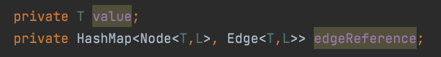
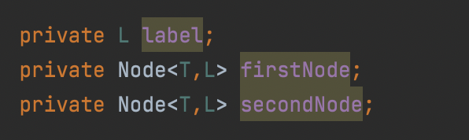
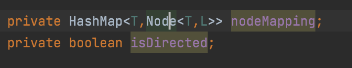
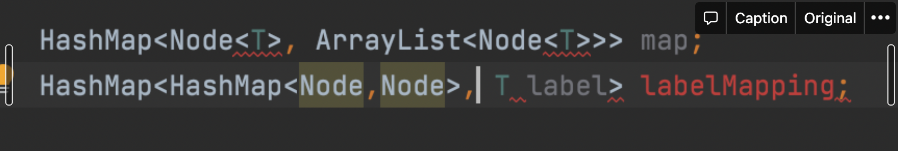
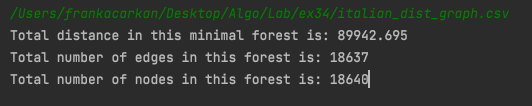

## Introduzione

Gli step dell'esercizio si articolano in 3 punti più un obbiettivo finale:

- Creazione dell'algoritmo di Union-Find-Set
- Creazione della struttura grafo generica che possa accogliere più tipi di nodi ed etichette di archi
- Creazione dell'algoritmo di Kruskal
- L'esecuzione dell'algoritmo su un dataset fornito

## Sezione 1

L'union find set  sono un algoritmo utilizzato su insiemi disgiunti per creare foreste attraverso 3 operazioni base:

- Make set che crea un set singleton avente l'unico nodo con rango iniziale pari a 0
- Find set, che si occupa di trovare in un certo set il rappresentante scalando il set attraverso i puntatori al genitore di ogni nodo finchè non arriva al nodo che fa riferimento a se stesso come genitore, la radice. Questa operazione si appoggia all'euristica del path compression, permettendoci di costruire dei set in cui ogni elemento punta direttamente alla radice
- Un'operazione di Union, che unisce set separati secondo una certa euristica di ordinamento
- Un'operazione di supporto link, in cui possiamo vedere l'euristica union by rank in atto che ci permette di impostare il genitore fra due radici di set diversi candidati

Le scelte implementative son state minime, principalmente ho creato dei casi all'interno di ogni metodo che tenessero conto della possibilità di avere parametri forniti null.

## Sezione 2

### Scelte implementative salienti

Dopo alcuni tentativi di rappresentare le strutture dati in diverse maniere ho scelto di sviluppare il Grafo come segue :

- Una classe Node parametrica  che rappresentasse i nodi con due attributi, uno che rappresentasse il generico valore del nodo e un'altro attributo di tipo hashmap con chiavi composte dai nodi adiacenti e valori come una classe Edge sempre generica che rappresenta l'arco che va a formarsi con il nodo adiacente.

  

- Una classe Edge parametrica che rappresentasse l'arco con tre attributi, il nodo di partenza e il nodo di arrivo con classi di appartenenza Node (sempre generiche) e infine l'etichetta come tipo generico, quest'ultima scelta del tipo generico.

  

- Il Grafo in se composto da una hashmap contenente come "chiavi" i valori effettivi dei nodi e come "valori" il Nodo a cui appartiene il valore nella chiave

  

La scelta di avere tre classi che si componessero tra loro in questa maniera è nata principalmente dal bisogno di avere i dati rilevanti alle operazioni connessi fra loro nelle complessità temporali stabilite e di rispettare il paradigma OOP.

Uno svantaggio minimo che ha la struttura scelta è una ridondanza del valore di un dato nodo, espresso come chiave nella hashmap e poi expresso di nuovo all'interno dei nodi presenti nei "valori" della stessa hashmap.

### Un tentativo prima delle strutture definitive

Ad esempio una delle prime scelte per rappresentare il Grafo, cercando di mantenere una classe Grafo composta per lo più da oggetti di classi native a Java, è stata quella di avere due strutture dati.

Una prima Hashmap che contenesse come chiavi una classe Nodo e come "valori" della hashmap delle istanze della classe ArrayList che rappresentassero i nodi adiacenti a a tale nodo.

La seconda struttura dati registrava gli archi come chiavi e le etichette di tali archi come "valori".

Questo esperimento è stato interrotto con alcune operazioni che richiedevano O(n) complessità temporale per essere eseguite ed altre che risultavano molto complicate con due strutture dati effettivamente sconnesse.

L'inserimento di ArrayList all'interno dell'Hashmap map, richiedeva un ciclo per recuperare un nodo adiacente con complessità temporale di almeno O(n) e per quanto riguarda la mappatura di archi-etichette senza una classe Edge, richiedeva a sua volta calcoli complessi anche per la più semplice delle operazioni.

(fig.1) Una riproduzione del tentativo

Ho pensato ad un attributo id nella classe Node per preservare la connessione fra le due strutture ma eccetto rari casi è proprio una violazione del paradigma OOP che favorisce invece la componibilità di oggetti, da questo ragionamento ho scelto di sviluppare le effettive classi presenti nel progetto come citato nella sezione precedente.

## Sezione 3

### Che cos'è l'algoritmo di Kruskal

L'algoritmo di Kruskal è un'algoritmo parte della famiglia degli algoritmi greedy, una famiglia di algoritmi che presuppone la minimizzazione ad ogni step del prossimo costo immediato per raggiungere una possibile minimizzazione totale del costo.

Gli algoritmi greedy applicati alla ricerca ricerca si presuppongono di ottimizzare i  singoli step che vengono eseguiti secondo una data euristica su un certo costo, nel caso del nostro obbiettivo finale espresso come l'etichetta rappresentativa della minor distanza fra due località.

### Applicazioni reali di Kruskal

Un'esempio più vicino a noi è l'utilizzo nelle reti LAN di grandi dimensioni, in questi casi per minimizzare la trasmissione di pacchetti attraverso la rete si cerca l'MST (Minimum Spanning Tree cioè l'albero minimo ricoprente) e questo è proprio ciò che restituisce l'esecuzione corretta dell'algoritmo di Kruskal su un grafo.

### Perchè usiamo Kruskal ?

Kruskal applicato a grafi sparsi, e per grafi sparsi intendiamo grafi in cui il numero di archi è inferiore al numero potenziale di archi, produce risultati migliori ed in tempi più veloci paragonato all'algoritmo gemello per grafi densi (grafi in cui il numero di archi è più vicino al numero potenziale di connessioni), l'algoritmo di Prim.

### Su che dataset ho usato questo algoritmo ?

Mi è stato fornito dai professori un dataset già preparato, senza valori assenti e non ordinato (fattore di cui si occupa direttamente l'algoritmo con un ordinamento non decrescente degli archi).

Il dataset riguarda la distanza fra alcune località fra cui alcune vi è una connessione bidirezionale.

Fonte dataset:

`https://datacloud.di.unito.it/index.php/s/PirTJpq4JMnpH3G`

### Risultati

L'MST prodotto dall'algoritmo di Kruskal partendo da un grafo ciclico risulta avere 18.637 archi, 18640 nodi e la distanza totale è di 89.942,695 km.

Gli archi vengono ridotti da un clamoroso 48.055 ad 18.637, una differenza di 29.418 archi, la distanza, data dalle etichette degli archi, viene ridotta da 437.496,12km a 89942.695km, viene quindi ridotta a circa il 20.55% della distanza totale. Una ottimizzazione in termini di distanza impressionante.

fig.1 Final result