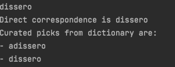

## Edit distance
L'algoritmo di edit distance in se calcola la distanza di edit fra due parole, la nostra implementazione tiene considerazione di due operazioni fondamentali cancellamento e inserimento.

Tale meccanismo lo abbiamo usato per correggere il pensiero di un bambino molto coraggioso dato un dizionario a nostra disposizione di 661562 parole.

Il dizionario ed il pensiero son reperibili al seguente indirizzo

```
https://datacloud.di.unito.it/index.php/s/gfoEndRSfwQKiHS
```

La distanza di edit si è dimostrata una tecnica troppo greedy per produrre risultati univoci.

Ottimizzando la distanza di edit di ogni singolo carattere senza considerare i livelli sintattici superiori (la parola, la singola frase ed il periodo) ed il livello semantico sono riuscito a produrre delle alternative corrette alle varie parole nella maggior parte dei casi.

Fatte alcune eccezioni per cui l'edit distance minore a parole corrette ha suggerito parole fuorvianti come nel caso in cui "andai" ha come suggerimenti "ande" e in rari casi come per "squola" in cui l'edit distance minore ritrova solo una alternativa scorretta "suole".

Qui sotto è possibile ritrovare i risultati completi


## Sperimentazione sul numero di corrispondenze

Con previa esecuzione dell'algoritmo e collezione di risultati, utilizzando una struttura dati ausiliare in cui vengono salvate le distanze minori è possibile ottimizzare l'algoritmo per selezionare parole con corrispondenza diretta alla parola già corretta di per sè, raffinando cosi l'analisi sintattica tramite edit distance


Snippet dello stato precedente alla modifica


Sotto uno snippet di codice ritraente le modifiche

```

int* distances = (int*) malloc(sizeof (int) * 30);

//correct_me analysis algorithm
for (i = 0; i < dictionary_size; i++) {  
    current_distance = edit_distance_strings(*word, dictionary[i]);  
  
 if(current_distance == 0) {  
        smallest_distance = current_distance;  
 curated_words[result_size++] = dictionary[i];  
 distances[distances_length++] = current_distance;  
 break; }  
  
    if (current_distance < smallest_distance) {  
        result_size = 0;  
 distances_length = 0;  
 smallest_distance = current_distance;  
 }  
  
    if (current_distance == smallest_distance) {  
        curated_words[result_size++] = dictionary[i];  
 distances[distances_length++] = current_distance;  
 }  
  
}

//print word in correct_me
printf("%s \n", *word);  

//print word with direct correspondence
for(int i = 0; i < distances_length; i++) {  
    if(distances[i] == 0) {  
         pick = curated_words[i];  
		 printf("Direct correspondence is %s \n", pick);  
	 }  
}

```

Sotto un esempio di esecuzione della modifica

