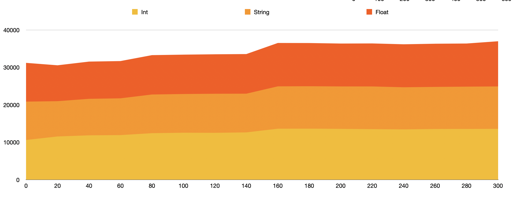
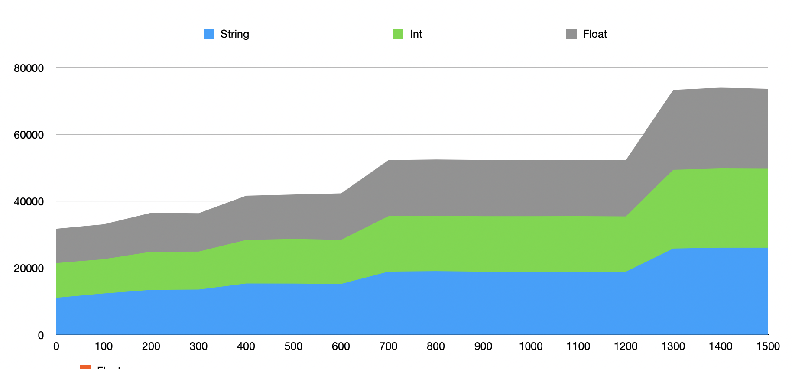
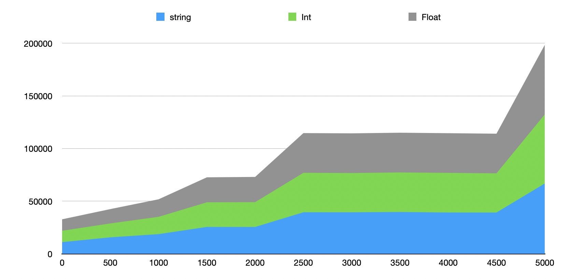

#Edit distance

##Introduzione

L'esercizio tratta la codifica di un algoritmo di sorting denominato merge binary insertion sort. L'algoritmo sfrutta un parametro k come punto decisionale per l'applicazione del binary insertion sort su un dato sottoarray e come punto finale utilizza il meccanismo di merge del classico merge sort per riunire le sottoliste.

Con la tecnica del divide and conquer facciamo diverse cose: prima di tutto riduciamo le sottosequenze su cui lavorare, questa prima fase è offerta dai meccanismi del merge sort in primo luogo. Successivemente con queste liste ridotte, una volta raggiunto un certo valore k si inizia ad applicare il binary insertion sort.

Nel binary insertion sort rivediamo il divide and conquer nella ricerca della posizione in cui inserire un certo elemento, riducendo cosi drasticamente il numero di paragoni che altrimenti l'insertion sort andrebbe a fare.

##Dati empirici

Prima di eseguire il processo sottostante ho stimato l'andamento su 3 punti cioè k uguale a 100, 1000, 1500 dopodichè ho scelto dei range per poter seguire l'andamento dei tempi con il variare di k.

Il processo che ho seguito è molto banale, è essenzialmente un ciclo while con k crescente ad ogni iterazione, e all'interno del ciclo ho eseguito un sorting completo sui tre campi

###Primo range : 0 <= k <= 300 e incrementi di 20 su k

Ritrovamenti

Su un range ristretto già si può vedere un lieve andamento crescente, non esattamente monotono crescente da datapoint a datapoint ma sull'intero range di dati i tempi son decisamente crescenti con una rampa sostanziosa tra k uguale a 140 e k uguale a 160.

Si intravede inoltre un lieve comportamento a gradino

###Secondo range

Osserviamo ora l'andamento nel secondo range con k compreso fra 0 e 1500, con incrementi di k di 100

Con questo range è possibile notare un chiaro comportamento a gradino in cui le salite si fan sempre più ripide e i plateau sempre più lunghi

###Terzo range : 0 <= k <= 5000 con incrementi di k di 500

Si conferma lo stesso pattern a gradino che si avvicina sempre di più ad una funzione a gradino ideale più si allarga la vista per accomodare un range di k più espanso

### Scelta di K
Per quanto riguarda una scelta ideale di K posso dire con certezza che convenga usare valori di k molto piccoli in un range 0-1000.

Per una scelta applicativa, all'interno di un range di valori di k piccoli, in un'area in cui il variare di k produce comunque un plateau graficamente si potrebbe accomodare una scelta di k basata su altri costraint che ci si ritrova ad affrontare con l'applicazione.